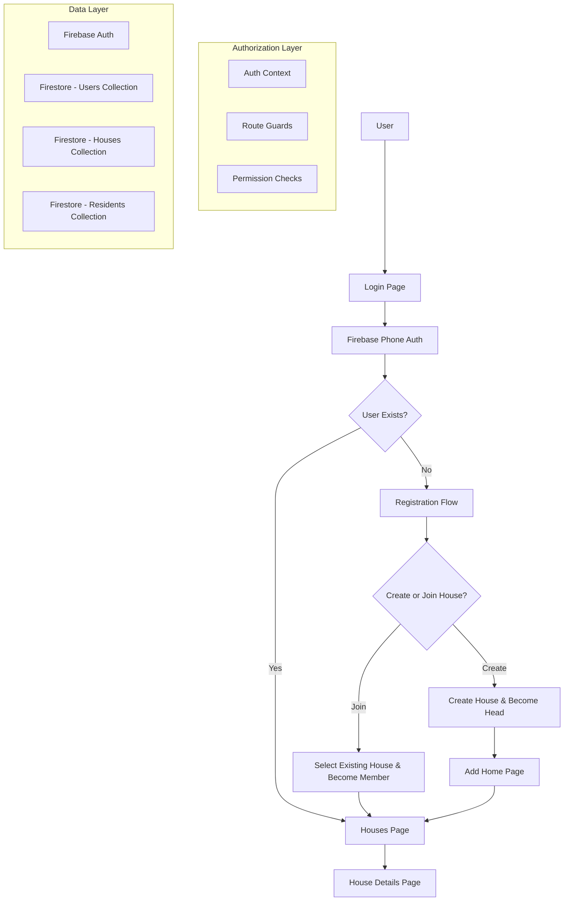
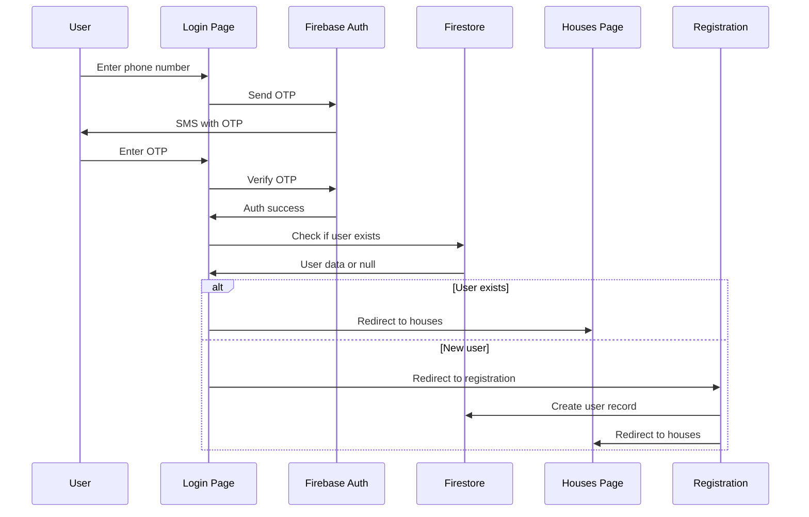

# Design Documents

## Overview

This design implements a phone number and OTP-based authentication system with house-based authorization for the MCLRA resident management application. The system leverages Firebase Authentication for phone verification and Firestore for user and house management. Users are categorized as either "head of family" (with edit permissions for their house) or "members" (with read-only access to all houses).

The authentication flow distinguishes between new and returning users, automatically routing them through appropriate registration or login processes. The system maintains a clear separation between authentication (who you are) and authorization (what you can do) concerns.

## Architecture

### High-Level Architecture



### Authentication Flow



## Components and Interfaces

### 1. Authentication Components

#### LoginPage Component

- **Purpose**: Handle phone number input and OTP verification
- **State**: phone number, OTP, verification ID, loading states
- **Methods**: sendOTP(), verifyOTP(), handleError()
- **Integration**: Firebase Phone Authentication

#### RegistrationPage Component

- **Purpose**: Handle new user registration flow
- **State**: user type selection, house selection/creation
- **Methods**: createHouse(), joinHouse(), validateHouseNumber()
- **Integration**: Firestore users and houses collections

#### AuthContext Provider

- **Purpose**: Manage global authentication state
- **State**: current user, loading, authentication status
- **Methods**: login(), logout(), checkAuthState()
- **Integration**: Firebase Auth state listener

### 2. Authorization Components

#### ProtectedRoute Component

- **Purpose**: Route-level access control
- **Props**: required permissions, fallback component
- **Logic**: Check user authentication and permissions
- **Integration**: React Router, AuthContext

#### PermissionGate Component

- **Purpose**: Component-level access control
- **Props**: required permissions, children, fallback
- **Logic**: Conditional rendering based on user permissions
- **Integration**: AuthContext, user role checking

### 3. Navigation Updates

#### Updated Layout Component

- **Purpose**: Show/hide navigation items based on user permissions
- **Logic**: Conditional rendering of "Add Home" link
- **Integration**: AuthContext for user role checking

### 4. Page-Level Authorization

#### Houses Page Updates

- **Purpose**: Show edit controls only for house heads
- **Logic**: Check if current user is head of specific house
- **Integration**: User context, house ownership checking

#### Add Home Page Updates

- **Purpose**: Restrict access to heads of family only
- **Logic**: Route guard and permission validation
- **Integration**: ProtectedRoute wrapper

## Data Models

### User Document Structure

```typescript
interface User {
  id: string; // Firebase Auth UID
  phoneNumber: string;
  role: "head" | "member";
  houseId: string; // Reference to house document
  createdAt: Timestamp;
  lastLoginAt: Timestamp;
}
```

### House Document Structure

```typescript
interface House {
  id: string; // Auto-generated document ID
  houseNumber: string; // Alphanumeric identifier
  headOfFamilyId: string; // Reference to user document
  memberIds: string[]; // Array of user document IDs
  createdAt: Timestamp;
  updatedAt: Timestamp;
}
```

### Updated Resident Document Structure

```typescript
interface ResidentDetails {
  // ... existing fields
  houseId: string; // Reference to house document
  createdBy: string; // User ID who created this record
  updatedBy: string; // User ID who last updated this record
}
```

### Authentication State Interface

```typescript
interface AuthState {
  user: User | null;
  loading: boolean;
  isAuthenticated: boolean;
  permissions: {
    canEditHouse: (houseId: string) => boolean;
    canAccessAddHome: boolean;
    canViewAllHouses: boolean;
  };
}
```

## Error Handling

### Authentication Errors

- **Invalid phone number**: Display format validation message
- **OTP verification failed**: Allow retry with clear error message
- **Network errors**: Show retry option with offline indicator
- **Firebase quota exceeded**: Display service unavailable message

### Authorization Errors

- **Unauthorized access**: Redirect to appropriate page with message
- **Permission denied**: Show access denied message with explanation
- **Session expired**: Redirect to login with session timeout message

### Data Validation Errors

- **Duplicate house number**: Prevent creation with clear error message
- **Invalid house selection**: Validate house exists before joining
- **Missing required fields**: Highlight fields with validation messages

### Error Recovery Strategies

- **Automatic retry**: For transient network errors
- **Graceful degradation**: Show cached data when possible
- **User guidance**: Clear instructions for resolving errors
- **Fallback options**: Alternative paths when primary flow fails

## Testing Strategy

### Unit Testing

- **Authentication functions**: OTP sending, verification, error handling
- **Authorization logic**: Permission checking, role validation
- **Data validation**: Input sanitization, format validation
- **State management**: Context updates, state transitions

### Integration Testing

- **Authentication flow**: Complete login/registration process
- **Authorization enforcement**: Route protection, component access control
- **Firebase integration**: Auth state changes, Firestore operations
- **Cross-component communication**: Context propagation, event handling

### End-to-End Testing

- **New user registration**: Phone verification → house creation → resident entry
- **Existing user login**: Phone verification → houses page access
- **Permission enforcement**: Head vs member access differences
- **Error scenarios**: Network failures, invalid inputs, unauthorized access

### Security Testing

- **Phone number validation**: Format checking, sanitization
- **OTP security**: Expiration, rate limiting, replay protection
- **Authorization bypass**: Attempt unauthorized access to protected resources
- **Data isolation**: Ensure users can only access appropriate data

## Implementation Considerations

### Firebase Configuration

- **Phone Authentication**: Enable in Firebase Console
- **Firestore Security Rules**: Implement user-based access control
- **Rate Limiting**: Configure OTP request limits
- **Regional Settings**: Configure for target geographic region

### Performance Optimization

- **Authentication State Caching**: Minimize Firebase Auth calls
- **Lazy Loading**: Load authentication components on demand
- **Optimistic Updates**: Update UI before server confirmation
- **Connection Handling**: Manage offline/online state transitions

### Security Measures

- **Input Sanitization**: Validate all user inputs
- **HTTPS Enforcement**: Ensure secure communication
- **Session Management**: Proper token handling and expiration
- **Audit Logging**: Track authentication and authorization events

### User Experience

- **Loading States**: Clear feedback during async operations
- **Error Messages**: User-friendly, actionable error descriptions
- **Progressive Enhancement**: Graceful degradation for poor connections
- **Accessibility**: Screen reader support, keyboard navigation
